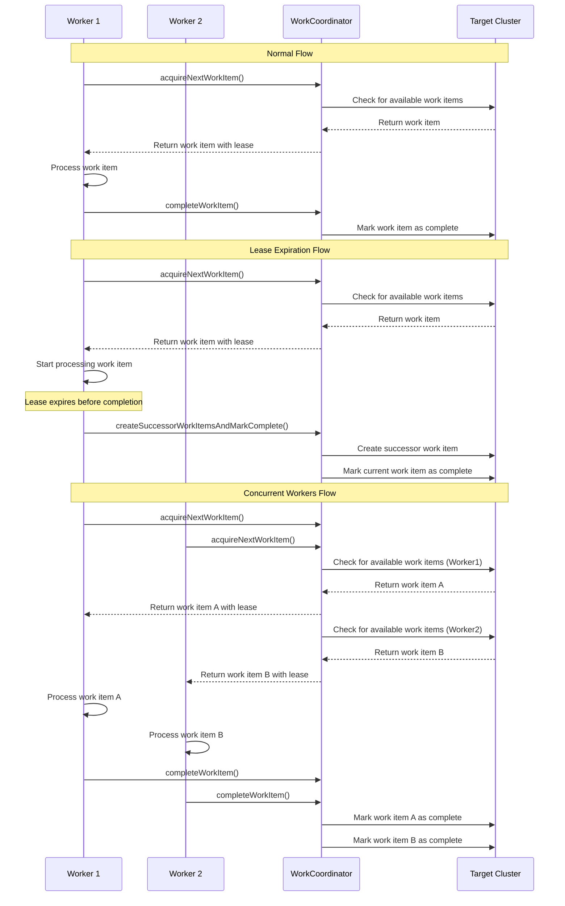

# Document Backfill System: Complexity Analysis

**CREATED: May 2025**

## Table of Contents
- [Introduction](#introduction)
- [Enhanced Component Class Diagram](#enhanced-component-class-diagram)
- [Detailed Data Flow Diagram](#detailed-data-flow-diagram)
- [Work Coordination Mechanism](#work-coordination-mechanism)
- [Error Handling and Recovery Paths](#error-handling-and-recovery-paths)
- [Reactive Programming Flow](#reactive-programming-flow)
- [Dependency and Coupling Analysis](#dependency-and-coupling-analysis)
- [Key Insights on Hidden Complexity](#key-insights-on-hidden-complexity)
- [Recommendations for Cleanup Strategy](#recommendations-for-cleanup-strategy)

## Introduction

The Document Backfill functionality is a core component of the OpenSearch Migrations project, responsible for migrating documents from a source Elasticsearch/OpenSearch cluster to a target OpenSearch cluster. While the existing design document provides a good overview of the system, it simplifies or obfuscates some of the complexity and interdependencies that exist in the actual implementation.

This document provides a deeper analysis of the Document Backfill system, focusing on:

1. Complex dependency relationships and coupling between components
2. The mix of synchronous and asynchronous operations
3. The reactive programming model using Reactor (Flux/Mono)
4. The sophisticated work coordination mechanism
5. Error handling and recovery paths across components
6. Version-specific implementations for different Elasticsearch/OpenSearch versions

Understanding these complexities is essential for developing an effective cleanup strategy.

## Enhanced Component Class Diagram

This diagram reveals the complex dependencies and coupling between components that are hidden in the current diagram, with special emphasis on interfaces versus implementations and how components can be swapped out:

```mermaid
classDiagram
    %% Main Components
    class RfsMigrateDocuments {
        +main()
        +run()
        +validateArgs()
        +getSuccessorWorkItemIds()
        +makeRootContext()
        -executeCleanShutdownProcess()
        -exitOnLeaseTimeout()
    }
    
    class DocumentsRunner {
        -ScopedWorkCoordinator workCoordinator
        -Duration maxInitialLeaseDuration
        -DocumentReindexer reindexer
        -SnapshotShardUnpacker.Factory unpackerFactory
        -BiFunction shardMetadataFactory
        -LuceneIndexReader.Factory readerFactory
        -Consumer~WorkItemCursor~ cursorConsumer
        -Consumer~Runnable~ cancellationTriggerConsumer
        -WorkItemTimeProvider timeProvider
        +migrateNextShard()
        -setupDocMigration()
        +ShardTooLargeException
    }
    
    %% Interfaces (shown with <<interface>> stereotype)
    class IWorkCoordinator {
        <<interface>>
        +acquireNextWorkItem()
        +completeWorkItem()
        +createSuccessorWorkItemsAndMarkComplete()
        +workItemsNotYetComplete()
        +setup()
        +createUnassignedWorkItem()
        +createOrUpdateLeaseForWorkItem()
    }
    
    class IJsonTransformer {
        <<interface>>
        +transformJson()
        +close()
    }
    
    class SourceRepo {
        <<interface>>
        +getFile()
        +listFiles()
    }
    
    class LuceneIndexReader {
        <<interface>>
        +readDocuments()
        +getReader()
    }
    
    %% Implementations
    class ScopedWorkCoordinator {
        -IWorkCoordinator delegate
        +ensurePhaseCompletion()
        +acquireNextWorkItem()
    }
    
    class CoordinateWorkHttpClient {
        -ConnectionContext connectionContext
        +acquireNextWorkItem()
        +completeWorkItem()
    }
    
    class S3Repo {
        -downloadFromS3()
        -cacheLocally()
    }
    
    class FileSystemRepo {
        -readLocalFiles()
    }
    
    class IndexReader6 {
        -handleES5Format()
    }
    
    class IndexReader7 {
        -handleES6Format()
        -handleSoftDeletes()
    }
    
    class IndexReader9 {
        -handleES7PlusFormat()
        -handleSoftDeletes()
    }
    
    class JsonTransformerForDocumentTypeRemoval {
        -transformJson()
    }
    
    class NoopTransformer {
        -transformJson()
    }
    
    %% Factories (shown with <<factory>> stereotype)
    class LuceneIndexReader.Factory {
        <<factory>>
        -ClusterSnapshotReader snapshotReader
        +getReader(Path)
    }
    
    class SnapshotShardUnpacker.Factory {
        <<factory>>
        -SourceRepoAccessor repoAccessor
        -Path luceneFilesBasePath
        -int bufferSize
        +create(ShardMetadata)
    }
    
    class WorkCoordinatorFactory {
        <<factory>>
        -Version targetVersion
        +get(CoordinateWorkHttpClient, int, String, Clock, Consumer)
    }
    
    class OpenSearchClientFactory {
        <<factory>>
        -ConnectionContext connectionContext
        +determineVersionAndCreate()
    }
    
    class TransformationLoader {
        <<factory>>
        +getTransformerFactoryLoader(String)
    }
    
    %% Other components
    class DocumentReindexer {
        -OpenSearchClient client
        -int maxDocsPerBulkRequest
        -long maxBytesPerBulkRequest
        -int maxConcurrentWorkItems
        -ThreadSafeTransformerWrapper threadSafeTransformer
        -boolean isNoopTransformer
        +reindex()
        -reindexDocsInParallelBatches()
        -sendBulkRequest()
        -transformDocumentBatch()
        -batchDocsBySizeOrCount()
    }
    
    class SnapshotShardUnpacker {
        -SourceRepoAccessor repoAccessor
        -Path luceneFilesBasePath
        -ShardMetadata shardMetadata
        -int bufferSize
        +unpack()
    }
    
    class OpenSearchClient {
        +sendBulkRequest()
        +getClusterVersion()
        +createIndex()
    }
    
    class WorkItemCursor {
        +getProgressCheckpointNum()
    }
    
    class LeaseExpireTrigger {
        -monitorLeaseExpiration()
        -triggerSuccessorCreation()
    }
    
    class WorkItemTimeProvider {
        -trackTimings()
        -calculateLeaseAdjustments()
    }
    
    class ThreadSafeTransformerWrapper {
        -wrapTransformer()
        -ensureThreadSafety()
    }
    
    class RfsLuceneDocument {
        -documentFields
        -documentId
        -progressCheckpoint
    }
    
    class RfsDocument {
        -transform()
        -fromLuceneDocument()
    }
    
    class BulkDocSection {
        -prepareForBulk()
    }
    
    %% Relationships with data flow direction and type
    RfsMigrateDocuments --> DocumentsRunner: creates and configures
    RfsMigrateDocuments --> LeaseExpireTrigger: sets up for lease monitoring
    RfsMigrateDocuments --> WorkCoordinatorFactory: uses to create coordinator
    
    %% Factory relationships
    WorkCoordinatorFactory --> IWorkCoordinator: creates
    LuceneIndexReader.Factory --> LuceneIndexReader: creates
    SnapshotShardUnpacker.Factory --> SnapshotShardUnpacker: creates
    OpenSearchClientFactory --> OpenSearchClient: creates
    TransformationLoader --> IJsonTransformer: creates
    
    %% Interface implementations
    ScopedWorkCoordinator ..|> IWorkCoordinator: implements
    CoordinateWorkHttpClient ..|> IWorkCoordinator: implements
    S3Repo ..|> SourceRepo: implements
    FileSystemRepo ..|> SourceRepo: implements
    IndexReader6 ..|> LuceneIndexReader: implements
    IndexReader7 ..|> LuceneIndexReader: implements
    IndexReader9 ..|> LuceneIndexReader: implements
    JsonTransformerForDocumentTypeRemoval ..|> IJsonTransformer: implements
    NoopTransformer ..|> IJsonTransformer: implements
    
    %% Component dependencies
    DocumentsRunner --> LuceneIndexReader: reads documents using (streaming)
    DocumentsRunner --> SnapshotShardUnpacker: unpacks shards using (synchronous)
    DocumentsRunner --> DocumentReindexer: reindexes documents using (async)
    DocumentsRunner --> ScopedWorkCoordinator: coordinates work using (sync/async)
    DocumentsRunner --> WorkItemCursor: tracks progress using
    DocumentsRunner ..> WorkItemTimeProvider: updates timing info
    
    DocumentReindexer --> OpenSearchClient: sends requests using (async)
    DocumentReindexer --> IJsonTransformer: transforms documents using (sync)
    DocumentReindexer --> WorkItemCursor: updates progress using
    DocumentReindexer --> ThreadSafeTransformerWrapper: ensures thread safety
    DocumentReindexer ..> RfsDocument: processes
    DocumentReindexer ..> BulkDocSection: creates for bulk requests
    
    LuceneIndexReader ..> RfsLuceneDocument: produces
    
    SnapshotShardUnpacker --> SourceRepo: reads files from
    
    RfsDocument ..> RfsLuceneDocument: created from
    
    LeaseExpireTrigger --> IWorkCoordinator: triggers successor creation
    
    %% Version-specific selection
    LuceneIndexReader.Factory --> IndexReader6: creates for ES 5.x
    LuceneIndexReader.Factory --> IndexReader7: creates for ES 6.x
    LuceneIndexReader.Factory --> IndexReader9: creates for ES 7.x+
    
    %% Wrapper relationships
    ThreadSafeTransformerWrapper --> IJsonTransformer: wraps
```



### Key Observations:

1. **Interface-Implementation Pattern**: The system extensively uses the interface-implementation pattern (IWorkCoordinator, IJsonTransformer, SourceRepo, LuceneIndexReader) to allow for component swapping and flexibility. While this provides extensibility, it also adds complexity through indirection.

2. **Factory Pattern Usage**: Multiple factory classes (LuceneIndexReader.Factory, SnapshotShardUnpacker.Factory, WorkCoordinatorFactory, etc.) are used to create and configure components, adding another layer of indirection and complexity.

3. **Version-Specific Implementations**: The LuceneIndexReader has three different implementations (IndexReader6, IndexReader7, IndexReader9) for different Elasticsearch/OpenSearch versions, with the appropriate implementation selected at runtime based on the source version.

4. **DocumentsRunner as a Central Hub**: DocumentsRunner has dependencies on multiple interfaces and implementations, making it a central hub that coordinates various operations and increasing coupling.

5. **Complex Component Swapping**: The system allows for swapping components (e.g., different SourceRepo implementations, different IJsonTransformer implementations), but this flexibility comes at the cost of increased complexity in configuration and initialization.

6. **Multiple Abstraction Layers**: The system uses multiple abstraction layers (e.g., IWorkCoordinator → ScopedWorkCoordinator → CoordinateWorkHttpClient), which adds complexity but provides flexibility for different implementations.

## Detailed Data Flow Diagram

This diagram distinguishes between synchronous and asynchronous operations, showing how data flows through the system:

```mermaid
flowchart TD
    %% Main components
    Start([Start]) --> RfsMigrateDocuments
    RfsMigrateDocuments --> |"1. Initialize"| Setup
    Setup --> |"2. Create components"| Components
    Components --> |"3. Start work"| DocumentsRunner
    
    %% Work acquisition flow
    DocumentsRunner --> |"4. Acquire work item\n(SYNCHRONOUS)"| WorkCoordinator
    WorkCoordinator --> |"5. Return work item with lease\n(SYNCHRONOUS)"| DocumentsRunner
    
    %% Shard processing flow (synchronous)
    DocumentsRunner --> |"6. Request shard unpacking\n(SYNCHRONOUS)"| SnapshotUnpacker
    SnapshotUnpacker --> |"7. Download shard files\n(SYNCHRONOUS)"| SourceRepo
    SourceRepo --> |"8. Return shard data\n(SYNCHRONOUS)"| SnapshotUnpacker
    SnapshotUnpacker --> |"9. Unpack into Lucene files\n(SYNCHRONOUS)"| LuceneFiles[(Lucene Files)]
    SnapshotUnpacker --> |"10. Return path to unpacked files\n(SYNCHRONOUS)"| DocumentsRunner
    
    %% Document reading flow (streaming)
    DocumentsRunner --> |"11. Create reader\n(SYNCHRONOUS)"| LuceneReader
    LuceneReader --> |"12. Open index\n(SYNCHRONOUS)"| LuceneFiles
    DocumentsRunner --> |"13. Request document stream\n(STREAMING)"| LuceneReader
    LuceneReader --> |"14. Produce document stream\n(STREAMING)"| DocStream[Document Stream]
    
    %% Document processing flow (streaming)
    DocumentsRunner --> |"15. Pass document stream\n(STREAMING)"| DocumentReindexer
    DocStream --> |"16. Flow documents\n(STREAMING)"| DocumentReindexer
    DocumentReindexer --> |"17. Buffer documents\n(STREAMING)"| DocBatches[Document Batches]
    
    %% Document transformation flow (parallel)
    DocBatches --> |"18. Transform in parallel\n(PARALLEL)"| Transformer
    Transformer --> |"19. Return transformed docs\n(PARALLEL)"| TransformedDocs[Transformed Documents]
    
    %% Bulk indexing flow (async)
    TransformedDocs --> |"20. Create bulk requests\n(ASYNC)"| BulkRequests[Bulk Requests]
    BulkRequests --> |"21. Send in parallel\n(ASYNC)"| OpenSearchClient
    OpenSearchClient --> |"22. Index to target\n(ASYNC)"| TargetCluster[(Target Cluster)]
    OpenSearchClient --> |"23. Return results\n(ASYNC)"| DocumentReindexer
    
    %% Progress tracking flow
    DocumentReindexer --> |"24. Update progress\n(ASYNC)"| WorkItemCursor
    WorkItemCursor --> |"25. Track progress\n(SYNC)"| DocumentsRunner
    
    %% Work completion flow
    DocumentsRunner --> |"26. Complete or create successor\n(SYNC)"| WorkCoordinator
    WorkCoordinator --> |"27. Update metadata\n(SYNC)"| TargetCluster
    
    %% Error handling paths
    SnapshotUnpacker -- |"Error: Shard too large"| ErrorHandler1[Error Handler]
    LuceneReader -- |"Error: Corrupt index"| ErrorHandler2[Error Handler]
    Transformer -- |"Error: Invalid document"| ErrorHandler3[Error Handler]
    OpenSearchClient -- |"Error: Bulk request failed"| Retry[Retry Logic]
    Retry --> BulkRequests
    
    %% Lease expiration path
    LeaseMonitor[Lease Monitor] --> |"Check lease expiration"| DocumentsRunner
    LeaseMonitor --> |"Lease expired"| SuccessorCreation[Create Successor Work Item]
    SuccessorCreation --> WorkCoordinator
    
    %% Legend
    classDef sync fill:#f96,stroke:#333,stroke-width:2px
    classDef async fill:#69f,stroke:#333,stroke-width:2px
    classDef streaming fill:#6f9,stroke:#333,stroke-width:2px
    classDef parallel fill:#f6f,stroke:#333,stroke-width:2px
    
    class SnapshotUnpacker,SourceRepo sync
    class OpenSearchClient,DocumentReindexer async
    class DocStream,LuceneReader streaming
    class Transformer,TransformedDocs parallel
```

### Key Observations:

1. **Mixed Processing Models**: The system mixes different processing models:
   - Synchronous operations for work coordination and shard unpacking
   - Streaming operations for document reading and initial processing
   - Parallel processing for document transformation
   - Asynchronous operations for bulk indexing

2. **Transition Points**: There are several transition points between different processing models, which can be sources of complexity and potential issues:
   - From synchronous to streaming (LuceneReader to DocumentReindexer)
   - From streaming to parallel (DocumentReindexer to Transformer)
   - From parallel to asynchronous (Transformer to OpenSearchClient)

3. **Multiple Error Handling Paths**: Different components have different error handling strategies, making it difficult to reason about the system's behavior in failure scenarios.

4. **Lease Monitoring**: The lease monitoring process runs in parallel to the main data flow, adding another dimension of complexity.

## Work Coordination Mechanism

This diagram illustrates the lease-based work coordination mechanism:



### Key Observations:

1. **Lease-Based Coordination**: The system uses a lease-based coordination mechanism to ensure that only one worker processes a work item at a time.

2. **Successor Work Items**: If a worker cannot complete a work item before its lease expires, it creates a successor work item to continue from the current progress point.

3. **Distributed State Management**: The coordination mechanism relies on distributed state management through metadata stored on the target cluster.

4. **Concurrent Workers**: Multiple workers can process different work items concurrently, which adds complexity to the coordination mechanism.

## Error Handling and Recovery Paths

This diagram shows the error handling and recovery paths across the system:

```mermaid
flowchart TD
    %% Main flow
    Start([Start]) --> DocumentsRunner
    DocumentsRunner --> SnapshotUnpacker
    SnapshotUnpacker --> LuceneReader
    LuceneReader --> DocumentReindexer
    DocumentReindexer --> OpenSearchClient
    OpenSearchClient --> Complete([Complete])
    
    %% Error paths
    SnapshotUnpacker -- Error --> ShardError[Shard Error]
    ShardError --> |"CouldNotUnpackShard\nException"| DocumentsRunner
    DocumentsRunner --> |"Mark work item\nas failed"| WorkCoordinator1[WorkCoordinator]
    
    LuceneReader -- Error --> ReadError[Read Error]
    ReadError --> |"IOException"| DocumentsRunner
    
    DocumentReindexer -- Error --> TransformError[Transform Error]
    TransformError --> |"Log error and\ncontinue"| DocumentReindexer
    
    OpenSearchClient -- Error --> BulkError[Bulk Request Error]
    BulkError --> |"Retry with\nexponential backoff"| OpenSearchClient
    BulkError --> |"After max retries"| DocumentReindexer
    
    %% Lease expiration
    LeaseMonitor[Lease Monitor] --> |"Check lease\nexpiration"| LeaseCheck{Lease Expired?}
    LeaseCheck --> |Yes| CreateSuccessor[Create Successor Work Item]
    LeaseCheck --> |No| Continue([Continue Processing])
    CreateSuccessor --> |"createSuccessorWorkItemsAndMarkComplete()"| WorkCoordinator2[WorkCoordinator]
    WorkCoordinator2 --> Exit([Exit Process])
    
    %% Process termination
    ProcessSignal[Process Signal\n(SIGTERM)] --> ShutdownHook[Shutdown Hook]
    ShutdownHook --> |"executeCleanShutdownProcess()"| CleanShutdown[Clean Shutdown]
    CleanShutdown --> |"createSuccessorWorkItemsAndMarkComplete()"| WorkCoordinator3[WorkCoordinator]
```

### Key Observations:

1. **Different Error Handling Strategies**: Different components use different error handling strategies:
   - SnapshotShardUnpacker throws exceptions that are caught by DocumentsRunner
   - DocumentReindexer logs errors and continues processing
   - OpenSearchClient retries failed bulk requests with exponential backoff

2. **Lease Expiration Handling**: Lease expiration is handled as a special case, triggering the creation of successor work items.

3. **Process Termination Handling**: The system includes a shutdown hook to handle process termination signals, ensuring that progress is not lost.

4. **Multiple Recovery Paths**: There are multiple recovery paths depending on the type of error, making it difficult to reason about the system's behavior in failure scenarios.

## Reactive Programming Flow

This diagram illustrates the reactive programming flow using Reactor (Flux/Mono):

```mermaid
flowchart LR
    %% Document reading flow
    LuceneReader --> |"Flux.using()"| Reader[Create Reader]
    Reader --> |"readDocsByLeavesFromStartingPosition()"| DocFlux[Document Flux]
    
    %% Document reindexing flow
    DocFlux --> |"reindex()"| Reindexer[DocumentReindexer]
    Reindexer --> |"publishOn(scheduler)"| PublishOn[Switch Thread]
    PublishOn --> |"buffer()"| Buffer[Buffer Documents]
    Buffer --> |"concatMapIterable()"| Transform[Transform Documents]
    Transform --> |"reindexDocsInParallelBatches()"| Parallel[Process in Parallel]
    
    %% Batch processing flow
    Parallel --> |"batchDocsBySizeOrCount()"| Batches[Create Batches]
    Batches --> |"limitRate()"| RateLimit[Rate Limit]
    RateLimit --> |"publishOn()"| SwitchThread[Switch Thread]
    SwitchThread --> |"flatMapSequential()"| FlatMap[Process Sequentially]
    
    %% Bulk request flow
    FlatMap --> |"sendBulkRequest()"| BulkRequest[Send Bulk Request]
    BulkRequest --> |"doOnSuccess()"| Success[Handle Success]
    BulkRequest --> |"doOnError()"| Error[Handle Error]
    BulkRequest --> |"onErrorResume()"| Resume[Resume on Error]
    
    %% Progress tracking
    Resume --> |"then(Mono.just())"| Progress[Track Progress]
    
    %% Cleanup
    Progress --> |"doFinally()"| Cleanup[Cleanup Resources]
```



### Key Observations:

1. **Complex Reactive Chain**: The system uses a complex chain of reactive operators (publishOn, buffer, concatMapIterable, flatMapSequential, etc.) to process documents.

2. **Thread Management**: The system uses multiple schedulers and thread pools to manage concurrency, which adds complexity to the system.

3. **Backpressure Handling**: The system uses operators like limitRate to handle backpressure, but the interaction between different parts of the reactive chain can be complex.

4. **Error Handling in Reactive Chain**: Error handling in the reactive chain is done using operators like doOnError and onErrorResume, which can make it difficult to trace error propagation.

## Dependency and Coupling Analysis

This table highlights the dependency relationships and coupling between components:

| Component | Dependencies | Coupling Type | Coupling Strength |
|-----------|--------------|--------------|-------------------|
| RfsMigrateDocuments | DocumentsRunner, IWorkCoordinator, LeaseExpireTrigger | Creation, Configuration | High |
| DocumentsRunner | LuceneIndexReader, SnapshotShardUnpacker, DocumentReindexer, ScopedWorkCoordinator | Method calls, Callbacks | Very High |
| DocumentReindexer | OpenSearchClient, IJsonTransformer, ThreadSafeTransformerWrapper | Method calls, Shared state | High |
| LuceneIndexReader | Version-specific readers (6,7,9) | Factory pattern, Inheritance | Medium |
| SnapshotShardUnpacker | SourceRepo | Method calls | Medium |
| IWorkCoordinator | Target cluster metadata | External state | High |

### Key Observations:

1. **High Coupling in DocumentsRunner**: DocumentsRunner has very high coupling with multiple components, making it difficult to change one component without affecting others.

2. **External State Dependency**: IWorkCoordinator has a high coupling with external state (target cluster metadata), which can make testing and reasoning about the system difficult.

3. **Version-Specific Logic**: LuceneIndexReader has medium coupling with version-specific implementations, which adds complexity but is managed through a factory pattern.

4. **Creation and Configuration Coupling**: RfsMigrateDocuments has high coupling with multiple components through creation and configuration, making it difficult to change the system's initialization logic.

## Key Insights on Hidden Complexity

1. **Synchronous vs. Asynchronous Operations**
   - The system mixes synchronous operations (shard unpacking, work coordination) with asynchronous streaming operations (document reading, transformation, reindexing)
   - This creates complexity in error handling and resource management
   - The transition points between different processing models are potential sources of bugs and performance issues

2. **Reactive Programming Complexity**
   - The use of Reactor (Flux/Mono) adds complexity through operators like publishOn, buffer, flatMapSequential
   - Thread management and backpressure handling are hidden in the reactive streams
   - Error handling in reactive chains is distributed across multiple operators and callbacks

3. **Tight Coupling Between Components**
   - DocumentsRunner is tightly coupled to multiple components (LuceneIndexReader, SnapshotShardUnpacker, DocumentReindexer, WorkCoordinator)
   - Changes to one component often require changes to multiple other components
   - The system has a complex object creation chain, making it difficult to initialize components independently

4. **Complex State Management**
   - Work coordination involves complex state management across distributed workers
   - Lease management and successor creation add significant complexity
   - The system relies on external state (target cluster metadata) for coordination

5. **Version-Specific Logic**
   - The system handles multiple Elasticsearch/OpenSearch versions with different implementations
   - This creates complexity in the LuceneIndexReader and document transformation logic
   - Version-specific code is scattered across multiple components

6. **Error Handling Across Components**
   - Error handling spans multiple components with different strategies
   - Some components use exceptions, others use reactive error handling
   - Recovery paths are complex and depend on the type of error

## Recommendations for Cleanup Strategy

Based on this analysis, here are some recommendations for cleaning up the system:

1. **Decouple Components**
   - Reduce the tight coupling between DocumentsRunner and other components
   - Introduce interfaces and dependency injection to make components more modular
   - Use the mediator pattern to centralize coordination logic

2. **Standardize Synchronous/Asynchronous Boundaries**
   - Clearly define and document which operations are synchronous vs. asynchronous
   - Consider using a more consistent approach to asynchronous programming
   - Simplify the reactive chains by breaking them into smaller, more manageable pieces

3. **Simplify Work Coordination**
   - Refactor the work coordination mechanism to reduce complexity
   - Consider using a more standard distributed coordination framework
   - Encapsulate lease management logic to make it more testable

4. **Improve Error Handling**
   - Standardize error handling approaches across components
   - Make error recovery paths more explicit and testable
   - Consider using a circuit breaker pattern for handling transient errors

5. **Abstract Version-Specific Logic**
   - Better encapsulate version-specific logic behind cleaner interfaces
   - Reduce the spread of version checks throughout the codebase
   - Use the strategy pattern to handle version-specific behavior

6. **Enhance Testing and Monitoring**
   - Improve test coverage, especially for error handling and recovery paths
   - Add more monitoring and observability to track system behavior
   - Create chaos testing scenarios to verify system resilience

7. **Refactor DocumentsRunner**
   - Split DocumentsRunner into smaller, more focused components
   - Reduce its responsibilities by moving logic to other components
   - Make it more testable by reducing dependencies

8. **Improve Documentation**
   - Document the synchronous/asynchronous boundaries
   - Create sequence diagrams for common scenarios and error paths
   - Document the reactive programming patterns used in the system

By addressing these areas, the Document Backfill system can be made more maintainable, testable, and resilient, while preserving its core functionality and performance characteristics.