# Document Backfill System: Enhanced Component Class Diagram

**CREATED: May 2025**

## Table of Contents
- [Introduction](#introduction)
- [Enhanced Component Class Diagram](#enhanced-component-class-diagram)
- [Object Creation Patterns](#object-creation-patterns)
- [Object Flow Through the System](#object-flow-through-the-system)
- [Key Lifecycle Sequences](#key-lifecycle-sequences)
- [Factory Pattern Implementation](#factory-pattern-implementation)
- [Dependency Injection](#dependency-injection)
- [Object Lifecycle Management](#object-lifecycle-management)

## Introduction

This document provides a comprehensive view of the Document Backfill system's component architecture, with special emphasis on how objects are created and passed through the system. The Enhanced Component Class Diagram reveals the complex dependencies and coupling between components, highlighting interfaces versus implementations and how components can be swapped out.

Understanding these relationships is essential for maintaining and extending the Document Backfill functionality, which is responsible for migrating documents from a source Elasticsearch/OpenSearch cluster to a target OpenSearch cluster.

## Enhanced Component Class Diagram

This diagram shows the key components of the Document Backfill system and their relationships, with a focus on object creation and flow:

```mermaid
classDiagram
    %% Main Components
    class RfsMigrateDocuments {
        +main()
        +run()
        +validateArgs()
        +getSuccessorWorkItemIds()
        +makeRootContext()
        -executeCleanShutdownProcess()
        -exitOnLeaseTimeout()
    }
    
    class DocumentsRunner {
        -ScopedWorkCoordinator workCoordinator
        -Duration maxInitialLeaseDuration
        -DocumentReindexer reindexer
        -SnapshotShardUnpacker.Factory unpackerFactory
        -BiFunction shardMetadataFactory
        -LuceneIndexReader.Factory readerFactory
        -Consumer~WorkItemCursor~ cursorConsumer
        -Consumer~Runnable~ cancellationTriggerConsumer
        -WorkItemTimeProvider timeProvider
        +migrateNextShard()
        -setupDocMigration()
        +ShardTooLargeException
    }
    
    %% Interfaces (shown with <<interface>> stereotype)
    class IWorkCoordinator {
        <<interface>>
        +acquireNextWorkItem()
        +completeWorkItem()
        +createSuccessorWorkItemsAndMarkComplete()
        +workItemsNotYetComplete()
        +setup()
        +createUnassignedWorkItem()
        +createOrUpdateLeaseForWorkItem()
    }
    
    class IJsonTransformer {
        <<interface>>
        +transformJson()
        +close()
    }
    
    class SourceRepo {
        <<interface>>
        +getFile()
        +listFiles()
    }
    
    class LuceneIndexReader {
        <<interface>>
        +readDocuments()
        +getReader()
    }
    
    %% Implementations
    class ScopedWorkCoordinator {
        -IWorkCoordinator delegate
        +ensurePhaseCompletion()
        +acquireNextWorkItem()
    }
    
    class CoordinateWorkHttpClient {
        -ConnectionContext connectionContext
        +acquireNextWorkItem()
        +completeWorkItem()
    }
    
    class S3Repo {
        -downloadFromS3()
        -cacheLocally()
    }
    
    class FileSystemRepo {
        -readLocalFiles()
    }
    
    class IndexReader6 {
        -handleES5Format()
    }
    
    class IndexReader7 {
        -handleES6Format()
        -handleSoftDeletes()
    }
    
    class IndexReader9 {
        -handleES7PlusFormat()
        -handleSoftDeletes()
    }
    
    class JsonTransformerForDocumentTypeRemoval {
        -transformJson()
    }
    
    class NoopTransformer {
        -transformJson()
    }
    
    %% Factories (shown with <<factory>> stereotype)
    class LuceneIndexReader.Factory {
        <<factory>>
        -ClusterSnapshotReader snapshotReader
        +getReader(Path)
    }
    
    class SnapshotShardUnpacker.Factory {
        <<factory>>
        -SourceRepoAccessor repoAccessor
        -Path luceneFilesBasePath
        -int bufferSize
        +create(ShardMetadata)
    }
    
    class WorkCoordinatorFactory {
        <<factory>>
        -Version targetVersion
        +get(CoordinateWorkHttpClient, int, String, Clock, Consumer)
    }
    
    class OpenSearchClientFactory {
        <<factory>>
        -ConnectionContext connectionContext
        +determineVersionAndCreate()
    }
    
    class TransformationLoader {
        <<factory>>
        +getTransformerFactoryLoader(String)
    }
    
    %% Other components
    class DocumentReindexer {
        -OpenSearchClient client
        -int maxDocsPerBulkRequest
        -long maxBytesPerBulkRequest
        -int maxConcurrentWorkItems
        -ThreadSafeTransformerWrapper threadSafeTransformer
        -boolean isNoopTransformer
        +reindex()
        -reindexDocsInParallelBatches()
        -sendBulkRequest()
        -transformDocumentBatch()
        -batchDocsBySizeOrCount()
    }
    
    class SnapshotShardUnpacker {
        -SourceRepoAccessor repoAccessor
        -Path luceneFilesBasePath
        -ShardMetadata shardMetadata
        -int bufferSize
        +unpack()
    }
    
    class OpenSearchClient {
        +sendBulkRequest()
        +getClusterVersion()
        +createIndex()
    }
    
    class WorkItemCursor {
        +getProgressCheckpointNum()
    }
    
    class LeaseExpireTrigger {
        -monitorLeaseExpiration()
        -triggerSuccessorCreation()
    }
    
    class WorkItemTimeProvider {
        -trackTimings()
        -calculateLeaseAdjustments()
    }
    
    class ThreadSafeTransformerWrapper {
        -wrapTransformer()
        -ensureThreadSafety()
    }
    
    class RfsLuceneDocument {
        -documentFields
        -documentId
        -progressCheckpoint
    }
    
    class RfsDocument {
        -transform()
        -fromLuceneDocument()
    }
    
    class BulkDocSection {
        -prepareForBulk()
    }
    
    class ShardWorkPreparer {
        +run()
    }
    
    %% Object creation relationships
    RfsMigrateDocuments ..> OpenSearchClientFactory : "1. creates"
    OpenSearchClientFactory ..> OpenSearchClient : "2. instantiates appropriate version"
    RfsMigrateDocuments ..> WorkCoordinatorFactory : "3. creates"
    WorkCoordinatorFactory ..> IWorkCoordinator : "4. instantiates implementation"
    RfsMigrateDocuments ..> DocumentReindexer : "5. creates with dependencies"
    RfsMigrateDocuments ..> DocumentsRunner : "6. creates with all dependencies"
    RfsMigrateDocuments ..> LeaseExpireTrigger : "7. sets up for lease monitoring"
    
    %% Factory relationships
    WorkCoordinatorFactory --> IWorkCoordinator: creates
    LuceneIndexReader.Factory --> LuceneIndexReader: creates
    SnapshotShardUnpacker.Factory --> SnapshotShardUnpacker: creates
    OpenSearchClientFactory --> OpenSearchClient: creates
    TransformationLoader --> IJsonTransformer: creates
    
    %% Interface implementations
    ScopedWorkCoordinator ..|> IWorkCoordinator: implements
    CoordinateWorkHttpClient ..|> IWorkCoordinator: implements
    S3Repo ..|> SourceRepo: implements
    FileSystemRepo ..|> SourceRepo: implements
    IndexReader6 ..|> LuceneIndexReader: implements
    IndexReader7 ..|> LuceneIndexReader: implements
    IndexReader9 ..|> LuceneIndexReader: implements
    JsonTransformerForDocumentTypeRemoval ..|> IJsonTransformer: implements
    NoopTransformer ..|> IJsonTransformer: implements
    
    %% Component dependencies and data flow
    DocumentsRunner --> LuceneIndexReader: reads documents using (streaming)
    DocumentsRunner --> SnapshotShardUnpacker: unpacks shards using (synchronous)
    DocumentsRunner --> DocumentReindexer: reindexes documents using (async)
    DocumentsRunner --> ScopedWorkCoordinator: coordinates work using (sync/async)
    DocumentsRunner --> WorkItemCursor: tracks progress using
    DocumentsRunner ..> WorkItemTimeProvider: updates timing info
    
    DocumentReindexer --> OpenSearchClient: sends requests using (async)
    DocumentReindexer --> IJsonTransformer: transforms documents using (sync)
    DocumentReindexer --> WorkItemCursor: updates progress using
    DocumentReindexer --> ThreadSafeTransformerWrapper: ensures thread safety
    DocumentReindexer ..> RfsDocument: processes
    DocumentReindexer ..> BulkDocSection: creates for bulk requests
    
    LuceneIndexReader ..> RfsLuceneDocument: produces
    
    SnapshotShardUnpacker --> SourceRepo: reads files from
    
    RfsDocument ..> RfsLuceneDocument: created from
    
    LeaseExpireTrigger --> IWorkCoordinator: triggers successor creation
    
    %% Version-specific selection
    LuceneIndexReader.Factory --> IndexReader6: creates for ES 5.x
    LuceneIndexReader.Factory --> IndexReader7: creates for ES 6.x
    LuceneIndexReader.Factory --> IndexReader9: creates for ES 7.x+
    
    %% Wrapper relationships
    ThreadSafeTransformerWrapper --> IJsonTransformer: wraps
```

## Object Creation Patterns

The Document Backfill system uses several patterns for object creation:

### Main Initialization Sequence

1. **RfsMigrateDocuments** serves as the entry point and orchestrates the creation of all major components:
   - Creates a `ConnectionContext` from command-line arguments
   - Creates an `OpenSearchClient` using `OpenSearchClientFactory`
   - Creates a `WorkCoordinatorFactory` based on the target version
   - Creates a `LeaseExpireTrigger` for monitoring lease expirations
   - Creates a `DocumentReindexer` with the client and transformer
   - Creates a `SourceRepo` (either `S3Repo` or `FileSystemRepo`)
   - Creates a `SnapshotShardUnpacker.Factory` for unpacking shards
   - Creates a `LuceneIndexReader.Factory` for reading documents
   - Creates a `DocumentsRunner` with all the above components

2. **Factory Pattern Usage**:
   - `OpenSearchClientFactory` determines which `OpenSearchClient` implementation to create based on the target cluster version
   - `WorkCoordinatorFactory` creates the appropriate `IWorkCoordinator` implementation
   - `LuceneIndexReader.Factory` creates the appropriate `LuceneIndexReader` implementation based on the source version
   - `SnapshotShardUnpacker.Factory` creates `SnapshotShardUnpacker` instances
   - `TransformationLoader` creates `IJsonTransformer` implementations based on configuration

3. **Dependency Injection**:
   - Components receive their dependencies through constructor parameters
   - This enables easier testing and component swapping
   - For example, `DocumentsRunner` receives all its dependencies in its constructor

## Object Flow Through the System

The Document Backfill system processes documents through several stages:

### Work Acquisition Flow

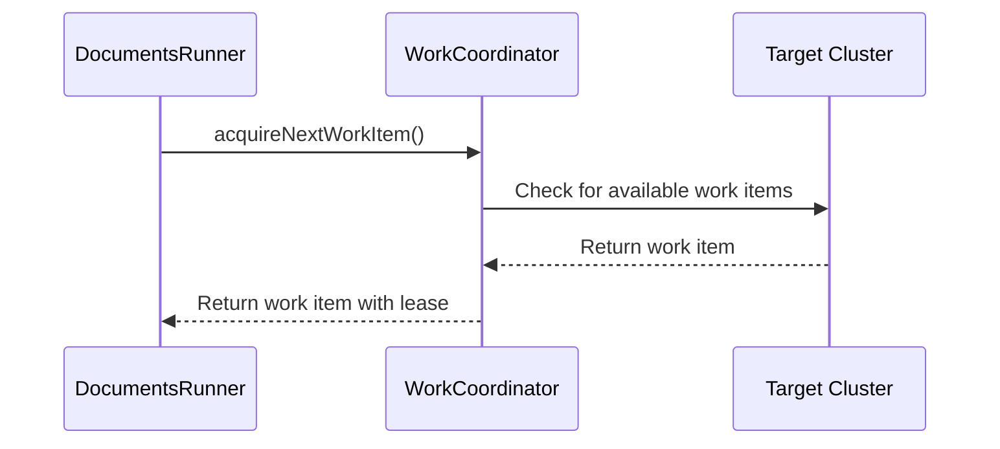

### Shard Processing Flow

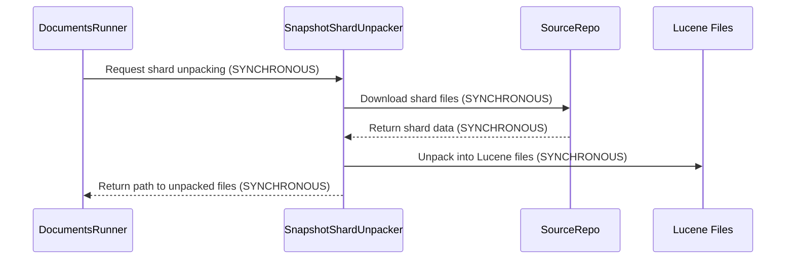

### Document Reading and Processing Flow

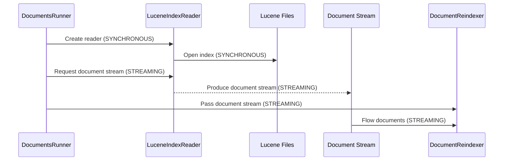

### Document Transformation and Indexing Flow

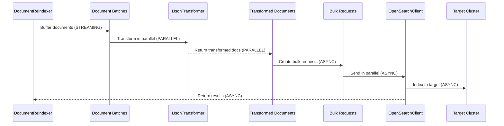

### Progress Tracking Flow

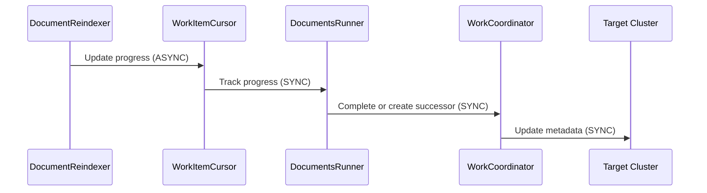

## Key Lifecycle Sequences

### Document Backfill Lifecycle

1. **Initialization**:
   - Parse command-line arguments
   - Create and configure components
   - Set up shutdown hooks for clean termination

2. **Work Coordination**:
   - Confirm shard preparation is complete
   - Check for available work items
   - Acquire a work item with a lease

3. **Shard Processing**:
   - Download and unpack shard files
   - Create a Lucene index reader
   - Stream documents from the Lucene index

4. **Document Processing**:
   - Transform documents using the configured transformer
   - Batch documents for efficient processing
   - Send bulk requests to the target cluster
   - Track progress using a cursor

5. **Work Completion**:
   - Mark work item as complete
   - Create successor work items if needed
   - Handle lease expiration and clean shutdown

## Factory Pattern Implementation

The Document Backfill system makes extensive use of the Factory pattern to create appropriate implementations based on version or configuration:

### OpenSearchClientFactory

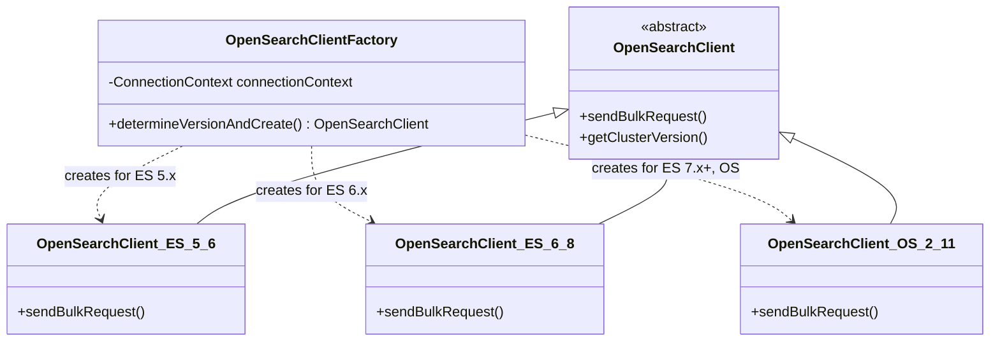

The `OpenSearchClientFactory` determines which implementation to create based on the target cluster version:
- `OpenSearchClient_ES_5_6` for Elasticsearch 5.x
- `OpenSearchClient_ES_6_8` for Elasticsearch 6.x
- `OpenSearchClient_OS_2_11` for Elasticsearch 7.x+ and OpenSearch

### LuceneIndexReader.Factory

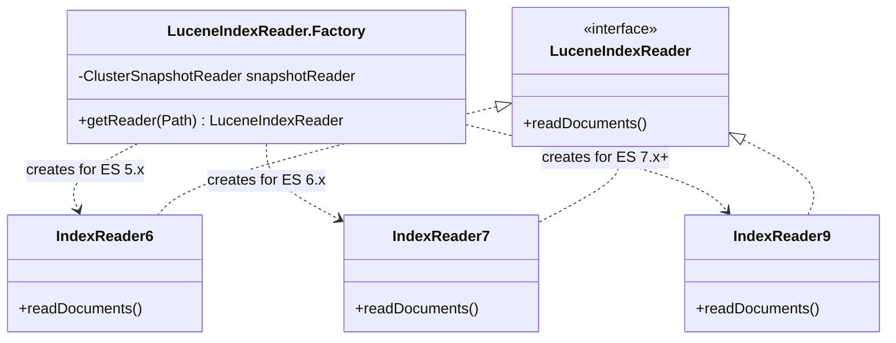

The `LuceneIndexReader.Factory` creates the appropriate reader implementation based on the source version:
- `IndexReader6` for Elasticsearch 5.x
- `IndexReader7` for Elasticsearch 6.x
- `IndexReader9` for Elasticsearch 7.x+

## Dependency Injection

The Document Backfill system uses constructor-based dependency injection to provide components with their dependencies:

### DocumentsRunner Dependencies

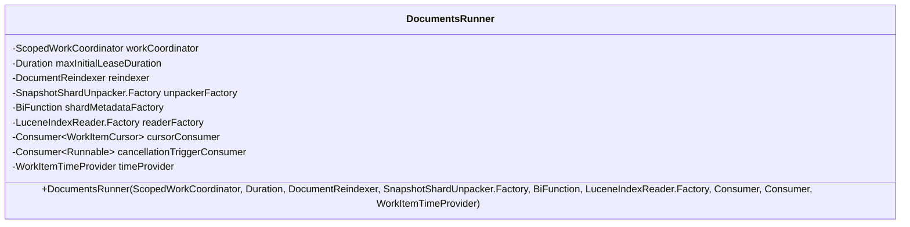

The `DocumentsRunner` receives all its dependencies through its constructor, which enables:
- Easier testing with mock dependencies
- Flexibility to swap out implementations
- Clear visibility of dependencies

### DocumentReindexer Dependencies

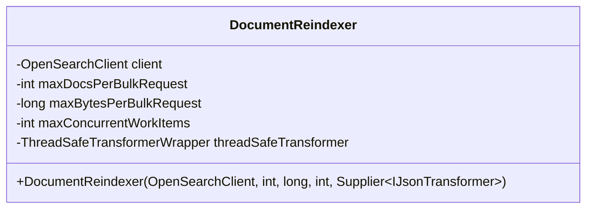

The `DocumentReindexer` receives its dependencies through its constructor, including:
- The `OpenSearchClient` for sending requests
- Configuration parameters for batch sizes
- A supplier for the `IJsonTransformer` to enable lazy initialization

## Object Lifecycle Management

The Document Backfill system manages object lifecycles through several mechanisms:

### Resource Cleanup

- `AutoCloseable` interfaces are implemented by components that need cleanup
- Shutdown hooks are registered to ensure clean termination
- Try-with-resources blocks are used for automatic resource cleanup

### Lease Management

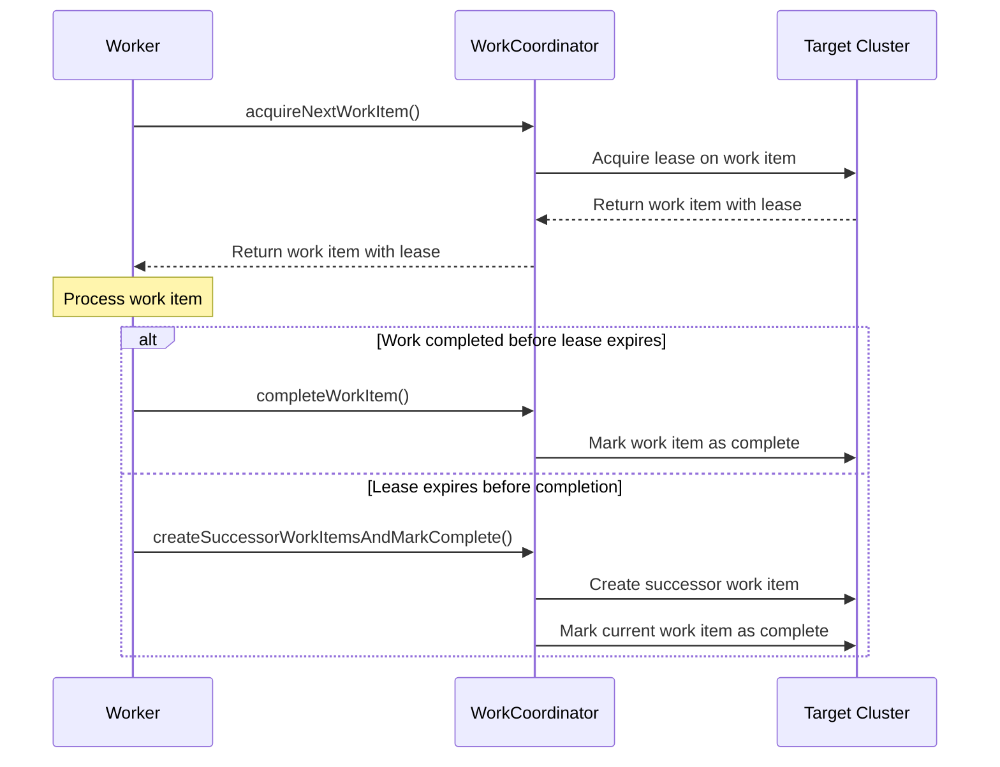

The system uses a lease-based approach to manage work items:
- Workers acquire a lease on a work item
- If the lease expires, a successor work item is created
- This ensures progress is not lost due to worker failures