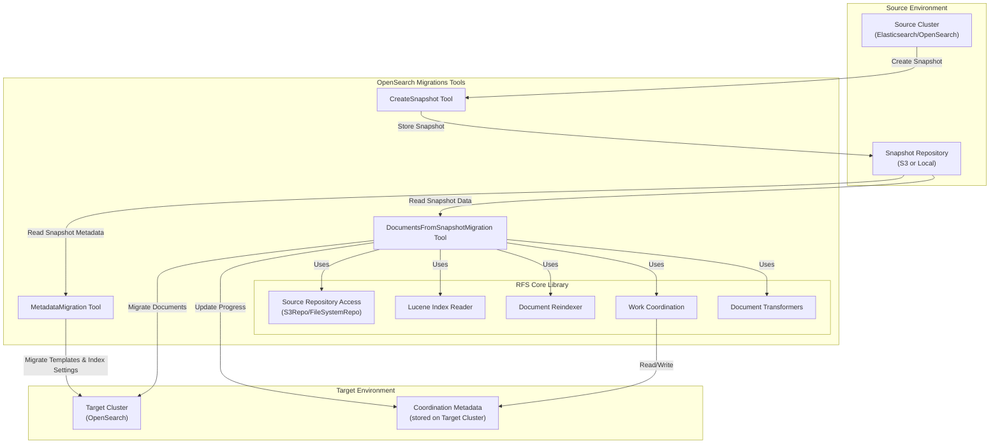
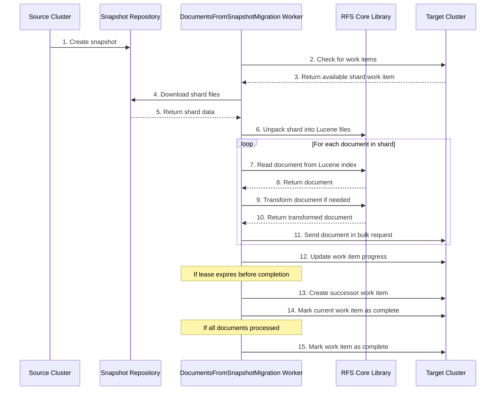
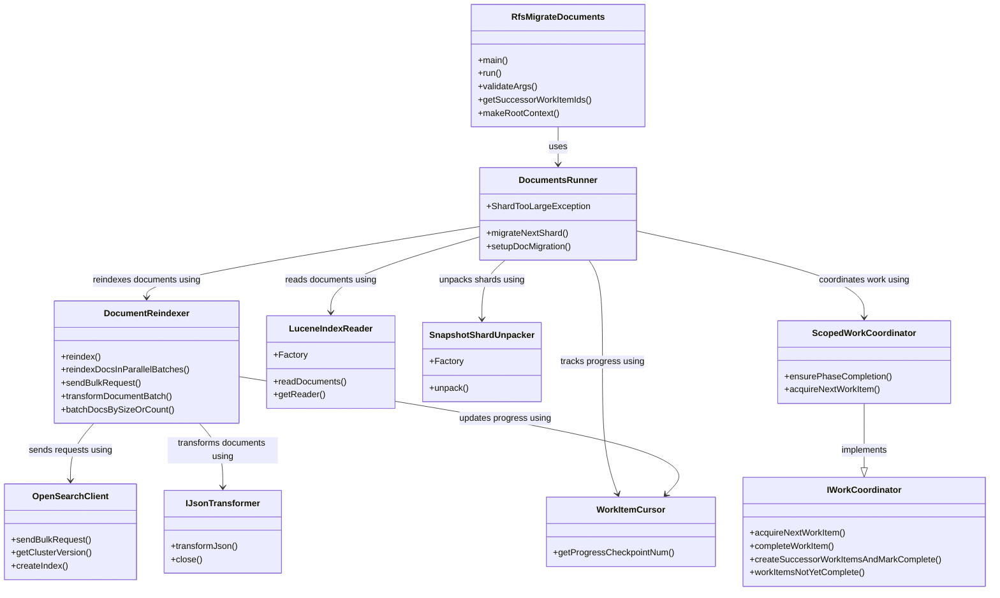

# Document Backfill Low-Level Design

**LAST UPDATED: May 2025**

## Table of Contents
- [Document Backfill Low-Level Design](#document-backfill-low-level-design)
  - [Table of Contents](#table-of-contents)
  - [Introduction](#introduction)
  - [System Architecture](#system-architecture)
    - [High-Level System Architecture](#high-level-system-architecture)
    - [Document Backfill Runtime Flow](#document-backfill-runtime-flow)
    - [Component Class Diagram](#component-class-diagram)
  - [Component Details](#component-details)
  - [Data Flow](#data-flow)
  - [Key Algorithms and Processes](#key-algorithms-and-processes)
  - [Work Coordination Mechanism](#work-coordination-mechanism)
  - [Document Transformation](#document-transformation)
  - [Error Handling and Recovery](#error-handling-and-recovery)
  - [Performance Considerations](#performance-considerations)
  - [Appendix: Work Item Schema](#appendix-work-item-schema)

## Introduction

The Document Backfill functionality is a core component of the OpenSearch Migrations project, responsible for migrating documents from a source Elasticsearch/OpenSearch cluster to a target OpenSearch cluster. This document provides a detailed low-level design of the Document Backfill system, focusing on its components, data flow, algorithms, error handling, and performance considerations.

Document Backfill operates by reading documents directly from snapshot files rather than querying the source cluster, which significantly reduces the load on the source cluster during migration. It leverages a distributed, fault-tolerant architecture that allows multiple workers to process different shards in parallel, coordinated through metadata stored on the target cluster.

## System Architecture

### High-Level System Architecture



The high-level architecture shows the key components and their interactions:

1. **Source Environment**: Contains the source Elasticsearch/OpenSearch cluster and the snapshot repository.
2. **OpenSearch Migrations Tools**: Includes the CreateSnapshot tool, MetadataMigration tool, and DocumentsFromSnapshotMigration tool.
3. **RFS Core Library**: Provides core functionality for accessing snapshots, reading Lucene indices, reindexing documents, coordinating work, and transforming documents.
4. **Target Environment**: Contains the target OpenSearch cluster and coordination metadata.

### Document Backfill Runtime Flow



The runtime flow illustrates the sequence of operations performed during document backfill:

1. A snapshot is created from the source cluster.
2. The worker checks for available work items on the target cluster.
3. The worker downloads and processes shard files from the snapshot.
4. Documents are read, transformed, and reindexed to the target cluster.
5. Work progress is tracked and updated on the target cluster.

### Component Class Diagram


    
## Component Details

### RfsMigrateDocuments

The `RfsMigrateDocuments` class serves as the entry point for the document migration process. It is responsible for:

1. **Initialization**: Setting up the environment, parsing command-line arguments, and initializing configuration.
2. **Worker Lifecycle Management**: Starting and managing the worker process.
3. **Execution Flow**: Orchestrating the overall execution flow of the document migration process.

Key methods:
- `main()`: The entry point for the application.
- `run()`: Executes the document migration process.

Configuration parameters include:
- Source snapshot repository details
- Target cluster connection details
- Worker configuration (batch size, thread count, etc.)
- Transformation rules

### DocumentsRunner

The `DocumentsRunner` class manages the overall document migration workflow. It is responsible for:

1. **Work Item Acquisition**: Acquiring work items from the work coordinator.
2. **Shard Migration**: Coordinating the migration of individual shards.
3. **Progress Tracking**: Tracking and reporting migration progress.

Key methods:
- `migrateNextShard()`: Migrates the next available shard.
- `setupDocMigration()`: Sets up the document migration environment.

The `DocumentsRunner` interacts with:
- `LuceneIndexReader` to read documents from Lucene indices
- `SnapshotShardUnpacker` to unpack shard files from snapshots
- `DocumentReindexer` to reindex documents to the target cluster
- `IWorkCoordinator` to coordinate work among multiple workers

### LuceneIndexReader

The `LuceneIndexReader` class reads documents from Lucene indices. It is responsible for:

1. **Index Opening**: Opening and accessing Lucene indices.
2. **Document Reading**: Reading documents from Lucene indices.
3. **Document Filtering**: Filtering documents based on criteria.

Key methods:
- `readDocuments()`: Reads documents from a Lucene index.
- `getReader()`: Gets a Lucene index reader.

The `LuceneIndexReader` handles:
- Different Lucene versions
- Deleted document filtering
- Document ordering for consistent processing

### SnapshotShardUnpacker

The `SnapshotShardUnpacker` class unpacks shard files from snapshots. It is responsible for:

1. **Shard Download**: Downloading shard files from the snapshot repository.
2. **Shard Unpacking**: Unpacking shard files into a format readable by Lucene.
3. **File Management**: Managing temporary files and directories.

Key methods:
- `unpack()`: Unpacks a shard from a snapshot.

The `SnapshotShardUnpacker` supports:
- Different snapshot repository types (S3, filesystem)
- Different Elasticsearch/OpenSearch versions
- Efficient file handling to minimize disk usage

### DocumentReindexer

The `DocumentReindexer` class reindexes documents to the target cluster. It is responsible for:

1. **Bulk Request Creation**: Creating bulk requests for efficient document indexing.
2. **Document Transformation**: Applying transformations to documents.
3. **Error Handling**: Handling indexing errors and retries.

Key methods:
- `reindex()`: Reindexes documents to the target cluster.
- `reindexDocsInParallelBatches()`: Reindexes documents in parallel batches.
- `sendBulkRequest()`: Sends a bulk request to the target cluster.

The `DocumentReindexer` features:
- Parallel processing for improved performance
- Batch processing to optimize network usage
- Error handling and retry logic

### IWorkCoordinator

The `IWorkCoordinator` interface defines the contract for work coordination. It is responsible for:

1. **Work Item Management**: Managing work items and their state.
2. **Lease Management**: Managing work item leases.
3. **Progress Tracking**: Tracking migration progress.

Key methods:
- `acquireNextWorkItem()`: Acquires the next available work item.
- `completeWorkItem()`: Marks a work item as complete.
- `createSuccessorWorkItemsAndMarkComplete()`: Creates successor work items and marks the current work item as complete.

The `IWorkCoordinator` ensures:
- Fault tolerance through lease-based work assignment
- Efficient work distribution among workers
- Consistent progress tracking

### OpenSearchClient

The `OpenSearchClient` class communicates with the target OpenSearch cluster. It is responsible for:

1. **Connection Management**: Managing connections to the target cluster.
2. **Request Execution**: Executing requests against the target cluster.
3. **Response Handling**: Handling responses from the target cluster.

Key methods:
- `sendBulkRequest()`: Sends a bulk request to the target cluster.

The `OpenSearchClient` provides:
- Connection pooling for efficient resource usage
- Retry logic for transient errors
- Timeout handling

### IJsonTransformer

The `IJsonTransformer` interface defines the contract for document transformation. It is responsible for:

1. **Document Transformation**: Transforming documents for compatibility.
2. **Version Handling**: Handling different Elasticsearch/OpenSearch versions.
3. **Schema Evolution**: Handling schema changes between versions.

Key methods:
- `transform()`: Transforms a document.

The `IJsonTransformer` supports:
- Version-specific transformations
- Custom transformation rules
- Error handling for transformation failures
    class IWorkCoordinator {
        +acquireNextWorkItem()
        +completeWorkItem()
        +createSuccessorWorkItemsAndMarkComplete()
    }
    
    class OpenSearchClient {
        +sendBulkRequest()
    }
    
## Data Flow

### Snapshot Creation and Access

1. The source cluster creates a snapshot of its data and stores it in the snapshot repository.
2. The snapshot repository can be either S3-based or filesystem-based.
3. The `SourceRepo` component provides access to the snapshot repository, abstracting away the underlying storage mechanism.
4. The `DocumentsFromSnapshotMigration` tool reads snapshot metadata to identify indices and shards.

### Work Item Acquisition

1. The `DocumentsRunner` uses the `IWorkCoordinator` to check for available work items on the target cluster.
2. Work items represent individual shards or portions of shards that need to be migrated.
3. The `IWorkCoordinator` acquires a lease on a work item, ensuring that only one worker processes it at a time.
4. The lease includes a timeout, after which the work item becomes available for other workers if not completed.

### Shard Processing

1. Once a work item is acquired, the `SnapshotShardUnpacker` downloads the corresponding shard files from the snapshot repository.
2. The shard files are unpacked into a format readable by Lucene.
3. The `LuceneIndexReader` opens the unpacked shard and reads documents from it.
4. Documents are read in a consistent order, allowing for resumable processing.

### Document Transformation and Reindexing

1. Each document read from the Lucene index is passed to the `IJsonTransformer` for transformation.
2. Transformations may include version compatibility changes, field mappings, or custom transformations.
3. Transformed documents are collected into batches by the `DocumentReindexer`.
4. The `DocumentReindexer` sends batches of documents to the target cluster using the `OpenSearchClient`.
5. Bulk requests are used for efficient indexing.

### Work Item Completion

1. As documents are processed, the `DocumentsRunner` tracks progress.
2. If all documents in a shard are processed, the work item is marked as complete.
3. If the lease expires before completion, a successor work item is created to continue from the current progress point.
4. The `IWorkCoordinator` updates the work item status on the target cluster.
    class IJsonTransformer {
        +transform()
    }
## Key Algorithms and Processes

### Work Coordination Algorithm

The work coordination algorithm ensures that work is distributed efficiently among workers and that progress is tracked accurately:

1. **Work Item Discovery**:
   - Workers query the target cluster for available work items.
   - Available work items include those that have not been started or have expired leases.

2. **Lease Acquisition**:
   - Workers attempt to acquire a lease on a work item using optimistic concurrency control.
   - The lease includes a timeout based on the work item's complexity and previous attempts.

3. **Progress Tracking**:
   - Workers update the work item with progress information as they process documents.
   - Progress is tracked using a cursor that points to the next document to be processed.

4. **Lease Renewal or Succession**:
   - If a worker completes a work item before the lease expires, it marks the work item as complete.
   - If a worker cannot complete a work item before the lease expires, it creates a successor work item to continue from the current progress point.

### Shard Unpacking Process

The shard unpacking process extracts documents from snapshot files:

1. **Shard Identification**:
   - The worker identifies the shard to be processed based on the work item.
   - The shard is identified by its index name and shard number.

2. **Shard Download**:
   - The worker downloads the shard files from the snapshot repository.
   - Files are downloaded to a temporary directory.

3. **Shard Unpacking**:
   - The worker unpacks the shard files into a format readable by Lucene.
   - This involves mapping obfuscated file names to their original names and reconstructing the Lucene directory structure.

4. **Lucene Index Opening**:
   - The worker opens the unpacked shard as a Lucene index.
   - The Lucene version is determined from the index metadata.

### Document Reading Process

The document reading process extracts documents from Lucene indices:

1. **Segment Identification**:
   - The worker identifies the segments in the Lucene index.
   - Segments are processed in a consistent order to ensure deterministic processing.

2. **Document Iteration**:
   - The worker iterates through documents in each segment.
   - Documents are identified by their segment-relative document ID.

3. **Document Filtering**:
   - Deleted documents are skipped.
   - Documents are filtered based on the progress cursor if resuming from a previous point.

4. **Document Extraction**:
   - The worker extracts the document's fields and values.
   - The document is converted from Lucene format to JSON format.

### Bulk Reindexing Process

The bulk reindexing process efficiently indexes documents to the target cluster:

1. **Batch Collection**:
   - Documents are collected into batches for efficient indexing.
   - Batch size is configurable and can be adjusted based on document size and network conditions.

2. **Parallel Processing**:
   - Multiple batches can be processed in parallel to improve throughput.
   - The number of parallel batches is configurable.

3. **Bulk Request Creation**:
   - Bulk requests are created for each batch of documents.
   - Each request includes the index name, document ID, and document content.

4. **Request Execution**:
   - Bulk requests are sent to the target cluster.
   - Responses are processed to identify successful and failed operations.

5. **Error Handling**:
   - Failed operations are retried with exponential backoff.
   - Persistent failures are logged and reported.

### Lease Management

The lease management process ensures that work items are processed efficiently and that progress is not lost due to worker failures:

1. **Lease Duration Calculation**:
   - Lease duration is calculated based on the work item's complexity and previous attempts.
## Work Coordination Mechanism

### Work Item Structure

Work items are stored as documents in a dedicated index on the target cluster. Each work item includes:

1. **Identifier**: A unique identifier for the work item, typically based on the index name, shard number, and progress cursor.
2. **Status**: The current status of the work item (e.g., pending, in-progress, completed, failed).
3. **Lease Information**: Information about the current lease, including the lease holder ID and expiration time.
4. **Progress Information**: Information about the current progress, including the progress cursor.
5. **Attempt Information**: Information about previous attempts, including the number of attempts and the lease duration used.
6. **Successor Information**: Information about successor work items, if any.

Example work item structure:
```json
{
  "id": "index1_shard2_0",
  "indexName": "index1",
  "shardNumber": 2,
  "progressCursor": 0,
  "status": "in-progress",
  "leaseHolderId": "worker-123",
  "leaseExpirationTime": "2025-05-16T15:00:00Z",
  "attempts": 1,
  "leaseDuration": 600000,
  "successorWorkItems": [],
  "createdAt": "2025-05-16T14:00:00Z",
  "updatedAt": "2025-05-16T14:00:00Z"
}
```

### Lease Acquisition

Lease acquisition ensures that only one worker processes a work item at a time:

1. **Work Item Selection**:
   - Workers query the target cluster for available work items.
   - Available work items include those that have not been started or have expired leases.

2. **Optimistic Concurrency Control**:
   - Workers use optimistic concurrency control to acquire a lease on a work item.
   - This involves updating the work item with the worker's ID and the lease expiration time.
   - The update includes a version check to ensure that the work item has not been modified since it was read.

3. **Lease Duration Calculation**:
   - Lease duration is calculated based on the work item's complexity and previous attempts.
   - Initial lease duration is configurable.
   - Lease duration increases exponentially with each attempt to handle increasingly difficult work items.

4. **Lease Validation**:
   - Workers validate their leases before processing work items.
   - This includes checking that the lease has not expired and that the worker is still the lease holder.

### Progress Tracking

Progress tracking ensures that work can be resumed from the last processed point:

1. **Progress Cursor**:
   - Progress is tracked using a cursor that points to the next document to be processed.
   - The cursor is based on the document's position in the Lucene index.

2. **Progress Updates**:
   - Workers update the progress cursor as they process documents.
   - Updates are performed periodically to balance update frequency and overhead.

3. **Checkpoint Creation**:
   - Workers create checkpoints at regular intervals.
   - Checkpoints include the current progress cursor and other relevant information.

4. **Progress Reporting**:
   - Workers report progress to the target cluster.
   - Progress reports include the number of documents processed, the current progress cursor, and other metrics.

### Successor Work Items

Successor work items ensure that work continues even if a worker fails:

1. **Successor Creation**:
   - If a worker cannot complete a work item before the lease expires, it creates a successor work item.
   - The successor work item continues from the current progress point.

2. **Successor Identification**:
   - Successor work items are identified by their relationship to the original work item.
   - This relationship is recorded in both the original and successor work items.

3. **Successor Prioritization**:
   - Successor work items may be prioritized over new work items.
   - This ensures that partially completed work is finished before new work is started.

4. **Successor Chain Limitation**:
   - The length of successor chains may be limited to prevent infinite chains.
   - If a work item has too many successors, it may be marked as failed and require manual intervention.

### Idempotent Operations

Idempotent operations ensure that work can be safely retried without causing duplicate processing:

1. **Document ID Preservation**:
   - Documents are indexed with their original IDs.
   - This ensures that reindexing the same document multiple times does not create duplicates.

2. **Work Item Deduplication**:
   - Work items are deduplicated based on their identifiers.
   - This ensures that the same work is not performed multiple times.

3. **Progress Cursor Validation**:
   - Progress cursors are validated to ensure that they point to valid positions.
   - This prevents processing the same document multiple times.
## Document Transformation

### Transformation Pipeline

The transformation pipeline processes documents to ensure compatibility with the target cluster:

1. **Input Validation**:
   - Documents are validated to ensure they are well-formed.
   - Invalid documents are rejected or corrected.

2. **Version Detection**:
   - The source document's version is detected.
   - This determines which transformations need to be applied.

3. **Field Mapping**:
   - Fields are mapped from source to target schema.
   - This may involve renaming, restructuring, or removing fields.

4. **Type Conversion**:
   - Field types are converted as needed.
   - This may involve converting between different numeric types, date formats, or string representations.

5. **Value Transformation**:
   - Field values are transformed as needed.
   - This may involve normalization, formatting, or other transformations.

6. **Output Validation**:
   - Transformed documents are validated to ensure they are compatible with the target cluster.
   - Invalid documents are rejected or corrected.

### Version Compatibility Transformations

Version compatibility transformations handle differences between Elasticsearch/OpenSearch versions:

1. **Field Name Changes**:
   - Field names that have changed between versions are mapped.
   - This ensures that documents are indexed with the correct field names.

2. **Type Changes**:
   - Field types that have changed between versions are converted.
   - This ensures that documents are indexed with the correct field types.

3. **Metadata Changes**:
   - Document metadata that has changed between versions is updated.
   - This ensures that documents are indexed with the correct metadata.

4. **Feature Compatibility**:
   - Features that are not supported in the target version are handled.
   - This may involve removing or modifying fields that use unsupported features.

### Custom Transformations

Custom transformations allow for specific modifications to documents:

1. **Field Addition**:
   - New fields can be added to documents.
   - This may involve calculating values based on existing fields or adding constant values.

2. **Field Removal**:
   - Fields can be removed from documents.
   - This may be useful for removing sensitive or unnecessary data.

3. **Value Modification**:
   - Field values can be modified.
   - This may involve applying functions, lookups, or other transformations.

4. **Document Filtering**:
   - Documents can be filtered based on criteria.
   - This may involve excluding certain documents from migration.

### Transformation Error Handling

Transformation error handling ensures that transformation failures do not halt the migration process:

1. **Error Detection**:
   - Transformation errors are detected and logged.
   - This includes validation errors, conversion errors, and other failures.

2. **Error Recovery**:
   - When possible, errors are recovered from by applying default values or fallback transformations.
## Error Handling and Recovery

### Shard Download Failures

Shard download failures occur when a worker cannot download shard files from the snapshot repository:

1. **Retry Logic**:
   - Download failures are retried with exponential backoff.
   - This handles transient network issues or repository access problems.

2. **Partial Download Recovery**:
   - If a download is partially complete, the worker attempts to resume from the last successfully downloaded file.
   - This reduces the amount of data that needs to be re-downloaded.

3. **Alternative Source Selection**:
   - If a file cannot be downloaded from the primary source, alternative sources may be tried.
   - This includes different repository endpoints or mirrors.

4. **Failure Reporting**:
   - Download failures are reported for analysis.
   - This includes the shard identifier, the file that failed to download, and the error details.

### Lucene Reading Errors

Lucene reading errors occur when a worker cannot read documents from a Lucene index:

1. **Segment Skipping**:
   - If a segment cannot be read, the worker may skip it and continue with other segments.
   - This allows partial recovery of data from a corrupted index.

2. **Document Skipping**:
   - If a document cannot be read, the worker may skip it and continue with other documents.
   - This allows partial recovery of data from a corrupted document.

3. **Index Reconstruction**:
   - In some cases, a corrupted index may be reconstructed from available data.
   - This involves using metadata and available segments to create a new index.

4. **Error Reporting**:
   - Reading errors are reported for analysis.
   - This includes the segment identifier, the document ID that failed to read, and the error details.

### Transformation Errors

Transformation errors occur when a worker cannot transform a document:

1. **Field-Level Recovery**:
   - If a field cannot be transformed, the worker may skip it or use a default value.
   - This allows the document to be indexed even if some fields cannot be transformed.

2. **Document-Level Recovery**:
   - If a document cannot be transformed, the worker may skip it or use a simplified version.
   - This allows the migration to continue even if some documents cannot be transformed.

3. **Transformation Fallbacks**:
   - Fallback transformations may be defined for common error cases.
   - This provides a way to handle known issues without manual intervention.

4. **Error Reporting**:
   - Transformation errors are reported for analysis.
   - This includes the document ID, the field that caused the error, and the error details.

### Bulk Request Failures

Bulk request failures occur when a worker cannot index documents to the target cluster:

1. **Request Retry**:
   - Failed requests are retried with exponential backoff.
   - This handles transient network issues or cluster overload.

2. **Batch Splitting**:
   - If a batch fails, it may be split into smaller batches and retried.
   - This helps identify and isolate problematic documents.

3. **Document-Level Retry**:
   - If specific documents fail, they may be retried individually.
   - This allows successful documents to be indexed while problematic ones are handled separately.

4. **Error Reporting**:
   - Indexing errors are reported for analysis.
   - This includes the document ID, the error details, and the number of retries.

### Lease Expiration Recovery

Lease expiration recovery ensures that work continues even if a worker fails to complete a work item before its lease expires:

1. **Successor Work Item Creation**:
   - If a lease is about to expire, the worker creates a successor work item.
   - The successor work item continues from the current progress point.

2. **Lease Expiration Detection**:
   - Workers monitor their leases to detect expiration.
   - If a lease expires, the worker terminates its processing.

3. **Work Item Reacquisition**:
   - Other workers can acquire expired work items.
   - The new worker continues from the last recorded progress point.

4. **Lease Duration Adjustment**:
   - Lease durations are adjusted based on processing time.
   - This helps prevent future lease expirations.

### Worker Process Failures
## Performance Considerations

### Parallelization Strategy

The Document Backfill system is designed for high parallelism to efficiently migrate large clusters:

1. **Shard-Level Parallelism**:
   - Each shard can be processed independently.
   - This allows for horizontal scaling by adding more workers.

2. **Worker Allocation**:
   - Workers can be dynamically allocated based on available resources.
   - This ensures efficient resource utilization.

3. **Batch-Level Parallelism**:
   - Within a worker, document batches can be processed in parallel.
   - This maximizes throughput for individual workers.

4. **Task Isolation**:
   - Each worker operates independently of others.
   - This minimizes coordination overhead and contention.

### Batch Processing

Batch processing optimizes document indexing performance:

1. **Batch Size Optimization**:
   - Batch sizes are optimized based on document size and network conditions.
   - Larger batches reduce overhead but increase memory usage.

2. **Adaptive Batching**:
   - Batch sizes can be adjusted dynamically based on performance metrics.
   - This ensures optimal performance as conditions change.

3. **Bulk Request Optimization**:
   - Bulk requests are structured to minimize overhead.
   - This includes optimizing request headers and metadata.

4. **Pipeline Batching**:
   - Documents are processed in a pipeline to overlap I/O and CPU operations.
   - This maximizes resource utilization.

### Resource Management

Resource management ensures efficient use of system resources:

1. **Memory Management**:
   - Memory usage is carefully controlled to prevent out-of-memory errors.
   - This includes limiting batch sizes and buffer sizes.

2. **Disk Space Management**:
   - Temporary files are cleaned up promptly to prevent disk space exhaustion.
   - This includes shard files and intermediate processing files.

3. **Network Bandwidth Management**:
   - Network usage is optimized to prevent congestion.
   - This includes rate limiting and prioritization of requests.

4. **CPU Utilization**:
   - CPU-intensive operations are balanced across available cores.
   - This ensures efficient use of processing resources.

### Target Cluster Load Management

Target cluster load management prevents overloading the target cluster:

1. **Indexing Rate Control**:
   - The rate of document indexing is controlled to prevent overload.
   - This includes adjusting batch sizes and worker counts.

2. **Backpressure Handling**:
   - Backpressure from the target cluster is detected and handled.
   - This includes reducing indexing rates when the cluster is under load.

3. **Resource Reservation**:
   - Resources on the target cluster can be reserved for migration.
   - This ensures consistent performance during migration.

4. **Load Balancing**:
   - Requests are distributed across target cluster nodes.
   - This prevents hotspots and ensures even load distribution.

### Monitoring and Metrics

Monitoring and metrics provide visibility into the migration process:

1. **Progress Tracking**:
   - Overall migration progress is tracked and reported.
   - This includes the number of documents processed and remaining.

2. **Performance Metrics**:
   - Performance metrics are collected and analyzed.
   - This includes throughput, latency, and resource utilization.

3. **Error Monitoring**:
   - Errors are monitored and analyzed.
   - This includes error rates, types, and patterns.

4. **Resource Utilization Monitoring**:
   - Resource utilization is monitored.
   - This includes CPU, memory, disk, and network usage.

## Appendix: Work Item Schema

Below is the schema for work items stored in the Coordinating Metadata Store (CMS):

```json
{
  "id": "string",                      // Unique identifier for the work item
  "type": "string",                    // Type of work item (e.g., "shard")
  "indexName": "string",               // Name of the index
  "shardNumber": "integer",            // Shard number
  "progressCursor": "integer",         // Current progress cursor
  "status": "string",                  // Status of the work item (e.g., "pending", "in-progress", "completed", "failed")
  "creatorId": "string",               // ID of the worker that created the work item
  "leaseHolderId": "string",           // ID of the worker that currently holds the lease
  "leaseExpirationTime": "timestamp",  // When the current lease expires
  "attempts": "integer",               // Number of times the work item has been attempted
  "leaseDuration": "integer",          // Duration of the current lease in milliseconds
  "successorWorkItems": [              // List of successor work items
    "string"
  ],
  "completedAt": "timestamp",          // When the work item was completed
  "createdAt": "timestamp",            // When the work item was created
  "updatedAt": "timestamp",            // When the work item was last updated
  "error": {                           // Error information if the work item failed
    "message": "string",               // Error message
    "stackTrace": "string",            // Error stack trace
    "count": "integer"                 // Number of errors encountered
  },
  "metrics": {                         // Performance metrics
    "documentsProcessed": "integer",   // Number of documents processed
    "documentsTotal": "integer",       // Total number of documents
    "bytesProcessed": "integer",       // Number of bytes processed
    "processingTime": "integer"        // Processing time in milliseconds
  }
}
```

This schema provides a comprehensive representation of work items, including their status, progress, lease information, and performance metrics. It enables efficient work coordination and progress tracking across multiple workers.

Worker process failures occur when a worker process crashes or is terminated:

1. **Process Monitoring**:
   - Worker processes are monitored for failures.
   - If a process fails, it is restarted or replaced.

2. **Work Item Recovery**:
   - Work items assigned to failed workers are recovered.
   - This involves detecting expired leases and reassigning the work.

3. **State Cleanup**:
   - Temporary files and resources created by failed workers are cleaned up.
   - This prevents resource leaks and disk space exhaustion.

4. **Failure Analysis**:
   - Worker failures are analyzed to identify patterns.
   - This helps prevent future failures through improvements to the system.
   - This ensures that documents can still be indexed even if some transformations fail.

3. **Error Reporting**:
   - Transformation errors are reported for analysis.
   - This includes the document ID, the field that caused the error, and the error details.

4. **Error Thresholds**:
   - Thresholds can be set for acceptable error rates.
   - If the error rate exceeds the threshold, the migration may be halted for manual intervention.

4. **Atomic Operations**:
   - Critical operations are performed atomically to prevent inconsistencies.
   - This includes work item updates and successor creation.
   - Initial lease duration is configurable.
   - Lease duration increases exponentially with each attempt to handle increasingly difficult work items.

2. **Lease Monitoring**:
   - Workers monitor their leases to ensure they do not expire.
   - If a lease is about to expire, the worker creates a successor work item.

3. **Lease Expiration Handling**:
   - If a lease expires, the work item becomes available for other workers.
   - The new worker continues from the last recorded progress point.

4. **Lease Adjustment**:
   - Lease duration is adjusted based on actual processing time.
   - If processing is faster than expected, lease duration is decreased.
   - If processing is slower than expected, lease duration is increased.
    

The component class diagram shows the key classes and their relationships:

1. **RfsMigrateDocuments**: The entry point for the document migration process. It handles initialization, command-line argument parsing, worker lifecycle management, and orchestrates the overall execution flow.

2. **DocumentsRunner**: Manages the overall document migration workflow. It acquires work items, coordinates shard migration, and tracks progress. It uses ScopedWorkCoordinator for work coordination and WorkItemCursor for progress tracking.

3. **LuceneIndexReader**: Reads documents from Lucene indices. It handles different Lucene versions (6, 7, 9) through its Factory class and filters deleted documents to ensure only "live" documents are processed.

4. **SnapshotShardUnpacker**: Unpacks shard files from snapshots. Its Factory creates instances configured for specific shards, handling the download and preparation of shard files for reading.

5. **DocumentReindexer**: Reindexes documents to the target cluster. It handles document transformation, batch processing for efficient network usage, and bulk request creation with retry logic.

6. **IWorkCoordinator**: Defines the contract for work coordination. It manages work items and their state, lease management, and progress tracking to ensure fault tolerance and efficient work distribution.

7. **ScopedWorkCoordinator**: Implements the IWorkCoordinator interface with additional scoping functionality. It provides a higher-level API for work coordination used by DocumentsRunner.

8. **OpenSearchClient**: Communicates with the target OpenSearch cluster. It handles connection management, request execution, and response handling with retry logic for transient errors.

9. **IJsonTransformer**: Transforms documents for compatibility. It handles version-specific transformations, field mappings, and custom transformations to ensure documents are compatible with the target cluster.

10. **WorkItemCursor**: Tracks progress during document migration. It maintains a checkpoint of the last processed document to enable resumable processing in case of failures.