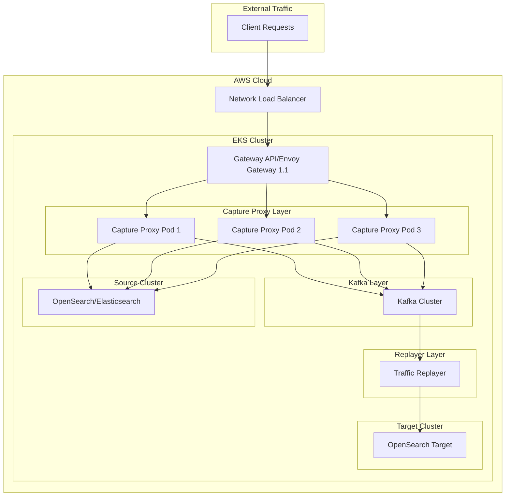

# Capture Proxy Gateway Architecture

This document provides an overview of the architecture for the Capture Proxy Gateway integration with EKS, NLB, and Gateway API with Envoy Gateway 1.1.

## Architecture Diagram



## Component Descriptions

### Network Load Balancer (NLB)

The AWS Network Load Balancer operates at Layer 4 (TCP) and provides high-performance, low-latency load balancing for the traffic entering the EKS cluster. It's configured with the following annotations:

```yaml
service.beta.kubernetes.io/aws-load-balancer-type: "nlb"
service.beta.kubernetes.io/aws-load-balancer-nlb-target-type: "ip"
service.beta.kubernetes.io/aws-load-balancer-scheme: "internet-facing"
```

### Gateway API v1.2 with Envoy Gateway 1.1

The Gateway API provides a standardized way to manage ingress traffic in Kubernetes. Envoy Gateway 1.1 implements the Gateway API and provides advanced traffic management features:

- TLS termination
- Path-based routing
- Traffic splitting
- Rate limiting
- Request/response transformation

Gateway API v1.2 introduces several new features that enhance the capabilities of the capture-proxy-gateway:

1. **Named Rules for HTTPRoute**: Makes routes more maintainable by allowing rules to be named and referenced.
2. **HTTPRoute Timeouts**: Configures request timeouts for improved resilience.
3. **HTTPRoute Retry Support**: Automatically retries failed requests based on status codes.
4. **HTTPRoute Percentage-Based Mirroring**: Mirrors a percentage of traffic to a secondary backend for testing.
5. **Gateway Infrastructure Labels and Annotations**: Propagates labels and annotations to generated infrastructure resources.
6. **Backend Protocol Support**: Supports WebSockets and HTTP/2 through the `appProtocol` field.

### Capture Proxy

The Capture Proxy is deployed as a scalable set of pods that:

1. Receive traffic from the Gateway API
2. Forward requests to the source cluster
3. Capture both requests and responses
4. Send captured traffic to Kafka

### Kafka

Kafka stores the captured traffic as TrafficObservations within TrafficStream objects. Each connection has a unique connectionId that serves as the partition key.

### Traffic Replayer

The Traffic Replayer reads from Kafka, reconstructs HTTP requests, applies transformations if needed, and sends them to the target cluster.

## Traffic Flow

1. Client sends a request to the NLB
2. NLB forwards the request to the Gateway API
3. Gateway API routes the request to the Capture Proxy based on routing rules
   - With Gateway API v1.2, this routing can include timeouts, retries, and traffic mirroring
   - WebSocket connections are supported through the `appProtocol` field
4. Capture Proxy forwards the request to the source cluster
5. Capture Proxy captures the request and response
6. Captured traffic is sent to Kafka
7. Traffic Replayer reads from Kafka and replays traffic to the target cluster

## EKS Integration

The capture-proxy-gateway chart is designed to work seamlessly with Amazon EKS:

1. **NLB Integration**: The chart creates a LoadBalancer service with NLB-specific annotations.
2. **Gateway API**: The chart installs Gateway API CRDs v1.2.0 and Envoy Gateway 1.1.0.
3. **Helm OCI Repository**: The chart uses the OCI repository `oci://docker.io/envoyproxy/gateway-helm` for Envoy Gateway installation.
4. **Upgrade Safety**: The chart includes unique job names for each revision to prevent conflicts during upgrades.

## Scaling Considerations

- **Capture Proxy**: Horizontally scalable through the Kubernetes Deployment
- **NLB**: Automatically scales based on traffic
- **Kafka**: Scaling requires careful consideration of partition assignments
- **Gateway API/Envoy Gateway**: Scales based on resource allocation and traffic patterns

## Security Considerations

- TLS termination can be configured at the Gateway API level
- Network policies can restrict traffic flow within the cluster
- AWS WAF can be integrated with the NLB for additional security
